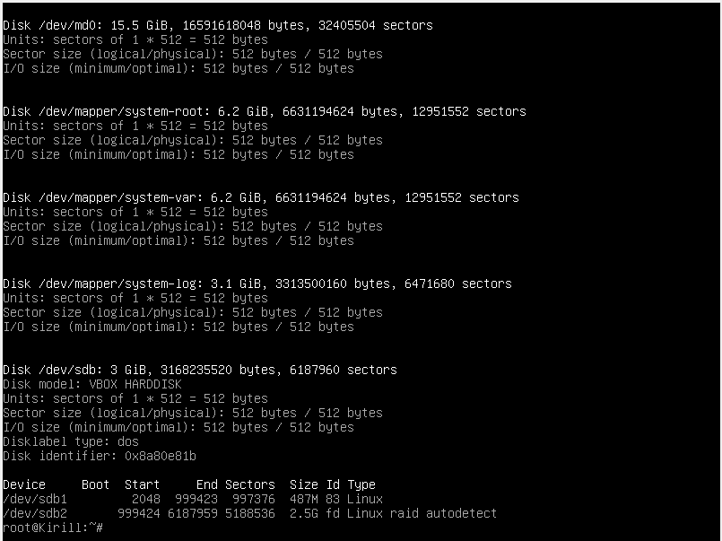

# Порпавка.
Я хотел сделать для каждой лабы свой репозиторий, но потом понял, что это нехорошо. Поэтому во второй лабе будут файлы с 1 и 5 лабой.

МИНОБРНАУКИ РОССИИ
Федеральное государственное бюджетное образовательное учреждение высшего образования

«МИРЭА – Российский технологический университет»
(РТУ МИРЭА)
Институт комплексной безопасности и специального приборостроения

Кафедра КБ-4 «Автоматизированные системы управления»

ОТЧЕТ
по лабораторным работам 1-5

Студент: Тихомиров Кирилл
Группа: ББСО-02-18

Москва, 2020

# Lab_2
## Отчёт по выполнению лабораторной работы номер 2

# Задание 1

К сожалению, я не заскринил настройки ОС в VB, но все було сделано чётко по примеру ( разве что только памяти выделил побольше на всякий )

#### Вот мы и создали ОС
Посмотрим, правильно ли создались диски с помощью fdisk -l

Также посмотрим диски в системе с помощью lsblk -o NAME,SIZE,FSTYPE,TYPE,MOUNTPOINT

При установки grub ошибок не вывелось

При попытке просмотреть информацию о текущем raid система не находит файл или директорию

Также посмотрим информацию о системе с помощью команд pvs, vgs, lvs, mount

## В итоге
Мы создали ОС по указаниям, создали два диска и просмотрели всю необходимую информацию.

# Задание 2
Удаляем один диск в нашей ОС. Перезапускаем машину и проверяем её работоспособность. 

Проверяем статус RAID-массива с помощью cat /proc/mdstat

Добавляем в интерфейсе VM новый диск такого же размера и называем е его ssd3. Смотрим информацию о дисках

Скопируем таблицу разделов со старого диска на новый

Смотрим новое состояние дисков

Добавим в рейд массив новый диск ( всегда говорит, что не хватает длины, хотя я много раз менял размер)

Итоговый результат

Выполним синхронизацию разделов, не входящих в RAID

Посмотрим состояние дисков 

## Итог
Мы удалили один диск, и добавили новый, для восстановления RAID массива. Скапировали данные со старого диска на новый.

# Задание 3

Допустим, у нас случился сбой с диском

Добавляем новый диск 

Для того, чтобы перенести /boot на новый диск нам сначала нужно установить загрузчик и создать новый RAID массив

Настроим LVM/ Создаем новый физический том.

Увеличим размер Volume Group system и увилим, что свободное место у md63 увеличилось, но пока var, log и root находятся на sda

Перенесем var, log, root на новый диск

Перенеслось успешно

На диске sda не осталось смонтированных элементов

Удаляем диск и добавиляем 1 SSD и 2 HDD

Востановим RAID массив

Перенесем загрузочный раздел со старого диска на новый

Увеличиваем размер второго раздела

Расширим размер RAID (размер md127 увеличился)

Разер LV не изменился

Распределим место между разделами

Создадим новый RAID массив, там создадим новый PV, в нем создадим группу и дадим все свободное простанство. 

Отформатируем раздел в ex4

Выполним синхронизацию и увидим, что у нас все получилось

В конце мы перезагрузим нашу ВМ и убедимся, что у нас все работает.

