# Отчёт по первой лабораторной работе
## Решение Suzen

### Suzen1
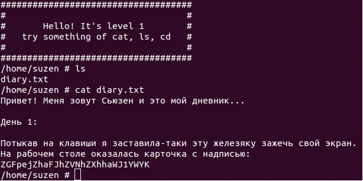

С помощью команды ls смотрим содержиоме каталога и открываем с помощью cat

### Suzen2
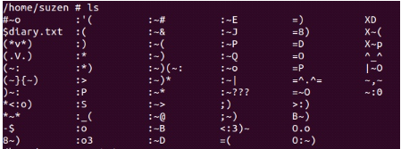

Командой cat соединяем файлы, начинающиеся с одного символа.

.png "")
Ключ в одном из файлов, которые начинаются с двоеточия.

### Suzen3
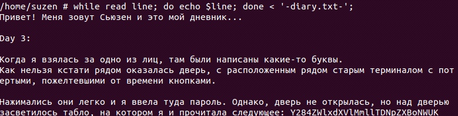

Читаем файл используя bash. do echo $line выводит строку, которая храниться в line Конструкция do echo $line выводит строку, которая храниться в line
Done показывает конец цикла
При помощи (< ‘-diary.txt-‘ ) мы направляем данные из дневника на ввод скрипту.

### Suzen14
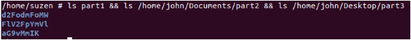
При помощи команды ls чекаем названия каталогов и находим ключ.

### Suzen15
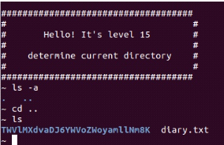

При помощи (cd ..) выходим из начальной директории
далее чекаем ее название через ls.

### Suzen16

Чекнуть информацию о пользователях можно двумя способами:
#1. Команда id
Команда предназначена для вывода информации о пользователях
Если не указывать параметр, то выведется информация о текущем пользователе и его группах
#2. Команда groups
Показывает группы, в которых состоит пользователь.

### Suzen18
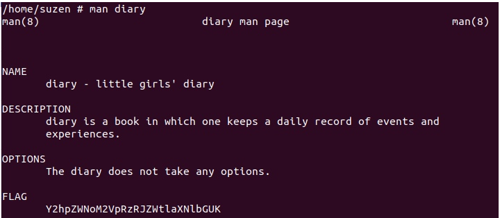

С помощью man читаем мануал diary

### Suzen19
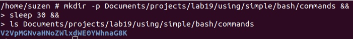

Создаем директории через mkdir

### Suzen20
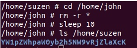

Переходи в john и удаляем все файлы с помощью rm. Флаг –r требуется для удаления каталогов

### Suzen21
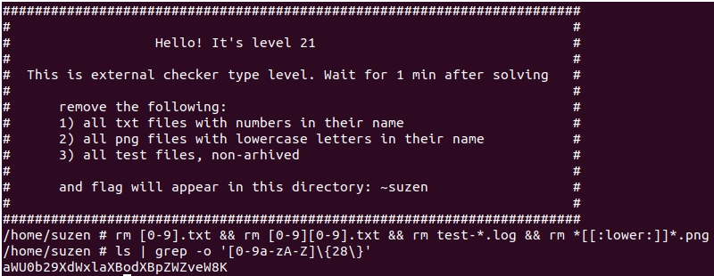

Используя утилиту rm с выражениями для удаления файлов. Утилита grep с ключом -o используется для поиска подстроки в выводe ls

### Suzen23
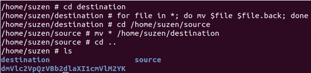

Сначала заходим в каталог destination и с помощью bash и утилиты mv переименовываем все файлы, которые находятся в данной директории. Потом заходим в source и перемещаем из данной директории в директорию destination, используя mv.

### Suzen24
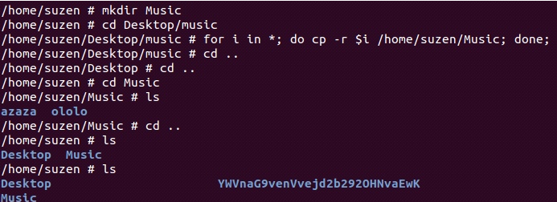

Создаем директорию Music в suzen. Переходим в Desktop/music и копируем все содержимое утилитой cp. Флаг –r нужен для копирования подкаталогов и файлов внутри данного каталога.

### Suzen25
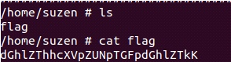

C помощью ls смотрим содержимое, с помощью cat открываем

### Suzen27
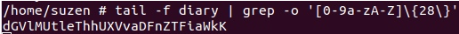

Запускаем утилиту tail с флагом -f для построчного чтения файла.

### Suzen29
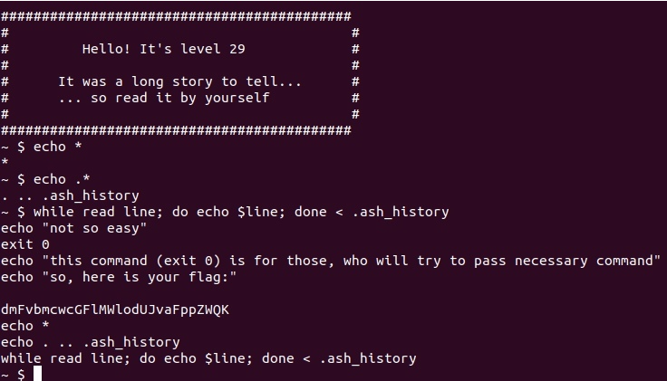

Пользуемся командой echo для просмотра файлов в каталоге. Находим скрытый файл и открываем его через echo, среди всего, что у нас вывело можно разглядеть файл. 
